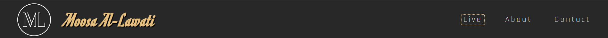
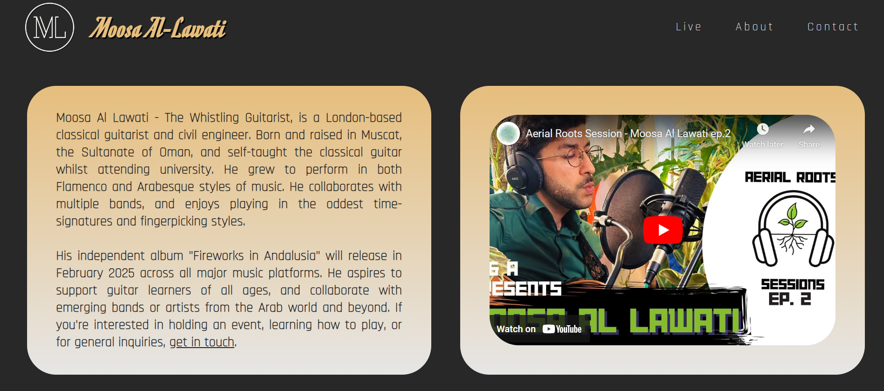

# Moosa Al-Lawati
### The Whistling Guitarist Website
[View Depoloyed Webite Here](https://moosaallawati.github.io/MilestoneProject1/ "Moosa Al-Lawati | The Whistling Guitarist")

  

## Purpose
This is a B2C website for Moosa Al-Lawati; a start-up guitar musician based in London, United Kingdom. The goal is to build brand awareness and retain exisiting users. The website provides a presentable schedule of his upcoming live **events** to return to later or book from, a useful **introduction** about Moosa for new users, a **video** showing his music performance to support the introduction, a **contact** form, and **social media** links. The target audience are English-speaking users but can be from anywhere, who are interested in:
- attending Moosa’s live events,
- knowing more about the musician personally,
- seeing and hearing a sample of his performance,
- learning how to play the guitar,
- hiring the guitarist for an event,
- getting in touch for other possible collaborations,
- and finding out Moosa's social media.  

Most emerging guitarists or musicians rely on a social media platform to officiate and centralise their business, but it is my view that a personal website should be the central point of one's venture; this is to give the musician more control over their content, intellectual property, as well as the user environment and experience influencing their decision or interaction more directly. However, unlike well-established musicians whose websites tend to contain several detailed pages, this website serves an emerging musician, therefore it is important to ensure that the user:
- does not feel lost in navigation,
- does not need to click a lot,
- finds information quickly and briefly,
- has the option to scroll without missing information,
- is eventually guided to the contact form,
- and knows what to expect upon returning.  

This website provides:
- a single scrollable page with sections, instead of multiple pages,
- a schedule of upcoming live events with key details and booking buttons,
- a section to learn about the guitarist and watch him perform,
- a intuitive contact form suited for all subjects,
- very few internal links, and external social media links,
- and straight-forward information.  

## Example User Stories
1. As a first time visitor, I want to easily know what this website is about, so I can decide my next interactions accordingly and comfortably.

2. As a potential client, I want to feel relatable toward the musician personally and see an example of their work, before asking them to perform at my wedding.

3. As someone who had previously attended one of Moosa’s concerts, I want to connect with his social media accounts as a fan.

4. As a frequent or returning visitor, I wish to see an updated list of Moosa’s upcoming live events with the date, time, venue, and the option to book.

5. As a talent agency or event producer, I want an intuitive contact form as I may invite this guitarist to audition, collaborate, or perform a concert.  

## Wireframes
#### Desktop Website


#### Mobile Website


## Scope & surface:
- For this website we need a single index.html document for the entire structure, so no other .html files are linked, reducing the complexity for a small website, and improving economy. A single style.css file is used to style the website.
- Only two fonts will be used; a special one **'Rajdhani'** for impressionist texts such as the logo. And **'Romanesco'** an easy on the eyes font for all main reading materials. These were provided using Google Fonts.
- The main color palette is **Dark Grey** rgb(40, 40, 40) as it’s more comfortable to sight than absolute black. **Golden** rgb(230, 190, 125) to mark an elegant characteristic about the brand, and **Off-white** rgb(230, 230, 230) to provide a symmetric contrast to the dark gray. Except for the red used in the “canceled” button, all three colors were sampled from the actual video used in the live background using the ‘eyedropper’ tool in Adobe Photoshop to obtain RGB values.
- All images are to have an alternative caption.
- Ensure that the video background does not hinder reading the live schedule.
- The maximum width of the website for larger screens is 1800px. It is centered on the screen using margin-left/right: auto.
- Desktop users will have all sections set to the same height as their viewport height. Mobile users will have each section set to just enough height to contain their child elements but no more, hence each section would have a different height value.  

## Structure
```html
<body>

    <header>
      HEADER
    </header>

    <section id="live">
      LIVE
    </section>

    <section id="about">
      ABOUT
    </section>

    <section id="contact">
      CONTACT
    </section>

    <footer>
      FOOTER
    </footer>

  </body>
```

The above HTML code provides a backbone structure through which information will be categorised, built upon, and mapped for navigation.  

## Screenshots, Features, UX & DX
#### Desktop Header

1. A logo div containing the brand icon which also links to the homepage index.html, and the brand name Moosa Al-Lawati.
2. There is no need to anchor the entire logo div, only a small portion of it i.e. the icon will be sufficient; this is to prevent the inconvenience of accidental clicks.
3. A navigation element containing an unordered list of menu items, each linking to the corresponding sectoin.
4. Menu items respond to mouse hovering; providing some interaction with the user through visual feedback.
5. The header element is fixed to the top of the website as the user scrolls down.
6. There was no need to use .active {} for menu links due to the scroll site type.

#### Desktop Live Section

1. There are two main divs: One as a container for a video; to act as the background of this section alone. The other to contain the schedule of live events.
2. The video autoplays and loops, but is muted to avoid causing any unprompted distraction whilst running behind the events div.
3. This is the main part of the website that makes it an ongoing developer experience; as the schedule would need updating periodically.
4. To solve this, **classes are used to control how each event will appear**; to avoid repeat styling. These are: .selling, .soldout, .cancelled, and .past
5. Since event buttons lead to external websites for booking purposes, they open in new windows.
6. As well as including button colours in the class style. Cancelled events are styled to render their corresponding button unclickable.
7. Information design is the key here; showing all dates, times, venues, and link buttons with consistency and presentability.
8. **Bugs:** buttons worked, but during HTML validation, I was warned that an anchor should not be inside the button element, so I swapped them. But then, the buttons were no longer clickable and the links didn't work. so I restored the previous nesting order.

#### Desktop About Section

1. Ther are two main divs here, one for a short biography, and one for a sample video.
2. The biography ends with a link to the contact page.
3. The video is embedded from Youtube.
4. As an iframe element an alternative descriptor was not possible to include.
5. **Bugs:** Different fonts were experimentd before resolving to Romanesco.

#### Desktop Contact Section, and Footer

1. This section contains a single div containing a form element made of two columns.
2. The user experiences some interaction via the hovering effect over the submit button.
3. The footer holds three links to external social media profiles of Moosa; they open in new windows.
4. The contact section has gradient background that eventually blends in with the footer background colour.
5. The social media logos were taken from Font Awesome.

---

#### Mobile Header

The media query point from Desktop to Mobile view occurs when width is 865px; this is based on manual testing on Google Chrome Developer mode of current elements and at which point the aesthetic arrangement breaks.


1. A div for a collapsible menu is introduced.
2. The aesthetics remain as that of the Desktop.
3. The hamburger button is taken from Font Awesome.

#### Mobile Live Section

1. The section height becomes auto adjustable according to the content of the events div.
2. The background video still plays; the dark background used behind the shedule provides clearance from moving pixels.

#### Mobile About Section

1. The biography div and the sample video div switch from being on the same line into being vertically ordered.

#### Mobile Contact Section

1. The two columns within the form switch from being on the same line into being vertically ordered.

#### Mobile Footer


## Version Control, Testing, and Deployment
* Versions were controlled using Git commits, and a Github account containing this website reposatory.
* During development, the website was tested manually for different screen sizes using Google Chrome Developer mode.
* The website was also tested using using other devices and browsers: Microsoft Edge, Samsung S20, and Iphone 12.
* A Page Load Analysis was carried out using Google Developer's Lighthouse, it reported a number of issues: [READ REPORT](MilestoneProject1_LighthouseReport.html "Lighthouse Report")
* W3 CSS Validator: [READ REPORT](MilestoneProject1_CSSValidation.html "CSS Check") - no problems found!
* W3 Nu HTML Checked: [READ REPORT](MilestoneProject1_HTMLValidation.html "HTML Check") - When attempting to fix buttons, links stopped working

## Future Improvements
* Consider a third media query for tablet screens such as an Ipad.
* Add a submission file to collect input data from the contact form users.
* Add a gallery for more photos and videos instead of a single video.
* Introduce more Java elements into the website design.

## Technologies and Credits
- Document version controlled using Git and Github
- Wireframes were designed using Google Docs
- Website Fonts from the Google Fonts Library
- Special icons from Font Awesome Library
- Colour Palette collected using Adobe Photoshop
- Code Institute tutor support for their helpful tips
- University Center Peterborough Student Support
- Sophia & Arnat for their video of Moosa: [SOURCE](https://www.youtube.com/@sophiaandarnat)
- Screens preview image made using Am-I-Responsive https://ui.dev/amiresponsive
- My course mentor Brian Macharia for his helpful tips.